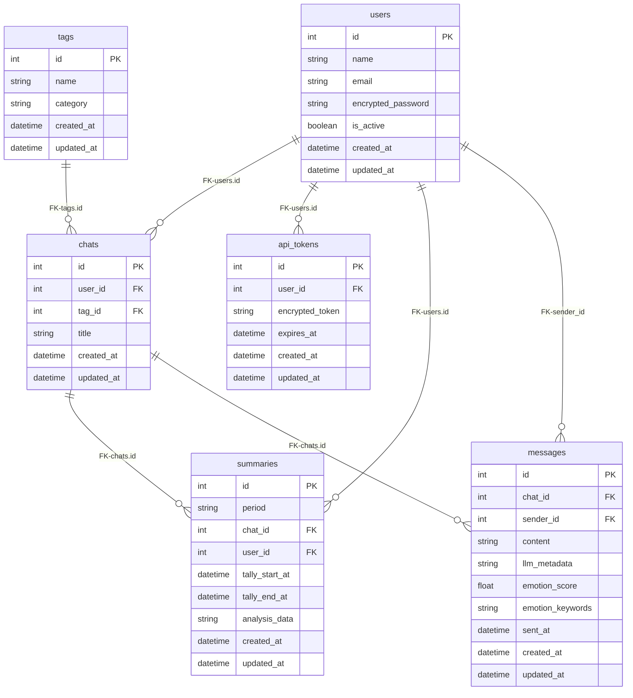

# 心のログ – データディクショナリ（完全RDB版）

> バックエンド：Rails（RDB＝MySQL）  
> 採用方針：**全データをRDBで管理**（インスタンススペック制約対応）、安定スキーマ・一意制約・集計/レポート最適化

---

## 前提（IDと整合の方針）
- **RDB（全データ管理）**：`users` / `tags` / `chats` / `api_tokens` / **`summaries`**（統合サマリ）/ **`messages`**（メッセージ）
- **ID整合**：外部キー制約による厳密な参照整合性

---
**テーブルの目的**と**各カラムの役割**

## RDB（MySQL）

### 1) users（ユーザー）
> **目的**：認証・認可の主軸となるユーザーアカウントの基表。表示名やログインID、パスワードハッシュを保持します。  
> **主なユースケース**：ログイン判定、プロフィール表示、所有データ（`chats`/`summaries`/`api_tokens`/`messages`）の紐付け。

| カラム名 | 型 | 制約 | 説明（カラムの役割） |
|---|---|---|---|
| id | BIGINT | PK | 主キー。アプリ内の一意なユーザー識別子。 |
| name | VARCHAR(50) | NOT NULL | 表示名。UIでの名前表記に使用（旧`username`を統合）。 |
| email | VARCHAR(255) | NOT NULL, UNIQUE | ログインID。ユニーク制約で重複登録を防止（小文字正規化推奨）。 |
| encrypted_password | VARCHAR(255) | NOT NULL | パスワードのハッシュ値（Devise等で管理）。 |
| is_active | BOOLEAN | NOT NULL | アカウントの有効/無効フラグ（退会・凍結時に無効化）。 |
| created_at | DATETIME | NOT NULL | 登録日時 |
| updated_at | DATETIME | NOT NULL | 更新日時 |

---

### 2) tags（感情タグマスタ）
> **目的**：会話（`chats`）に付与および検索/集計の絞り込み用の**感情タグ**のマスタ。  
> **主なユースケース**：チャット一覧のフィルタ、期間集計のグルーピング。

| カラム名 | 型 | 制約 | 説明（カラムの役割） |
|---|---|---|---|
| id | BIGINT | PK | タグID。 |
| name | VARCHAR(50) | NOT NULL, UNIQUE | タグ名（重複禁止）。例：`仕事`、`家族`、`健康`。 |
| category | VARCHAR(30) |  | タグの種別。例：`topic`（話題）、`emotion`（感情系）、`value`（価値観軸）など。 |
| created_at | DATETIME | NOT NULL | 登録日時 |
| updated_at | DATETIME | NOT NULL | 更新日時 |

---

### 3) chats（チャットセッション）
> **目的**：1回の対話セッションの**チャットメタ情報**（所有者・感情タグ・タイトル等）を保持する軽量コンテナ。  
> **主なユースケース**：会話一覧表示、タイトル編集、タグによる絞り込み、セッション要約（`summaries`）の紐付け、メッセージ（`messages`）の紐付け。

| カラム名 | 型 | 制約 | 説明（カラムの役割） |
|---|---|---|---|
| id | BIGINT | PK | チャットID。メッセージテーブルから直接参照。 |
| user_id | BIGINT | NOT NULL, FK→users.id | このチャットの所有ユーザー。 |
| tag_id | BIGINT | NULL, FK→tags.id | 公式タグ（任意・1対1）。UIの絞り込みに使用。 |
| title | VARCHAR(120) |  | セッションの自動/手動タイトル。 |
| created_at | DATETIME | NOT NULL | 登録日時 |
| updated_at | DATETIME | NOT NULL | 更新日時 |

---

### 4) api_tokens（個人APIトークン）
> **目的**：不透明トークン（ハッシュ化済）の保存による**端末認可/外部クライアント**アクセスの制御。即時失効や回収が容易です。  
> **主なユースケース**：モバイル/デスクトップクライアントの継続ログイン、個人アクセストークン発行。

| カラム名 | 型 | 制約 | 説明（カラムの役割） |
|---|---|---|---|
| id | BIGINT | PK | 主キー。 |
| user_id | BIGINT | NOT NULL, FK→users.id | トークンの所有者。 |
| encrypted_token | VARCHAR(191) | NOT NULL, UNIQUE | トークンのハッシュ（平文は保存しない）。 |
| expires_at | DATETIME |  | 失効日時（期限切れ判定）。 |
| created_at | DATETIME | NOT NULL | 発行日時 |
| updated_at | DATETIME | NOT NULL | 更新日時 |

---

### 5) summaries（統合サマリ）
> **目的**：**チャット単位（session）**または**ユーザー単位（日/週/月）**の要約・洞察・感情分布・メトリクスを**1レコードで一意**に保持。  
> **主なユースケース**：日次/週次/月次の要約・感情分析レポート保持。

| カラム名 | 型 | 制約 | 説明（カラムの役割） |
|---|---|---|---|
| id | BIGINT | PK | 主キー。 |
| period | ENUM('session','daily','weekly','monthly') | NOT NULL | 集計粒度。 |
| chat_id | BIGINT | 条件付, FK→chats.id | `period='session'` のとき必須（対象チャット）。 |
| user_id | BIGINT | 条件付, FK→users.id | `period in ('daily','weekly','monthly')` のとき必須（対象ユーザー）。 |
| tally_start_at | DATETIME | NOT NULL | バケット開始（UTC）。例：日次0:00、週次週頭、月次月初、セッション開始。 |
| tally_end_at | DATETIME | NOT NULL | バケット終了（UTC）。UI/再集計の境界に利用。 |
| analysis_data | JSON | NOT NULL | サマリ本体。例：`{ "summary": "...", "insights": {...}, "sentiment_overview": {...}, "metrics": {...} }` |
| created_at | DATETIME | NOT NULL | 登録日時 |
| updated_at | DATETIME | NOT NULL | 更新日時 |

---

### 6) messages（メッセージ本文 - RDB版）
> **目的**：チャットセッション内の**発話本文**をRDBで保存（インスタンススペック制約対応版）。  
> **主なユースケース**：チャット画面の時系列メッセージ表示、会話要約/感情分析（`summaries`）対象、全文検索。

| カラム名 | 型 | 制約 | 説明（カラムの役割） |
|---|---|---|---|
| id | BIGINT | PK | メッセージID。一意識別子。 |
| chat_id | BIGINT | NOT NULL, FK→chats.id, INDEX | 所属チャットセッション。インデックス付きで高速検索。 |
| sender_id | BIGINT | NOT NULL, FK→users.id | メッセージ送信者。ユーザーID（AIやシステムメッセージでも関連ユーザーIDを保存）。 |
| content | TEXT | NOT NULL | 本文（テキスト／音声起こし結果）。可変長対応。 |
| llm_metadata | JSON |  | 生成モデル・トークン数・プロンプト情報などのメタデータ。 |
| emotion_score | DECIMAL(3,2) |  | 感情強度（0.00〜1.00）。小数点2桁精度。 |
| emotion_keywords | JSON |  | キーワード配列（例：`["上司","納期"]`）。JSON配列で格納。 |
| sent_at | DATETIME | NOT NULL, INDEX | 送信日時。時系列ソート用インデックス付き。 |
| created_at | DATETIME | NOT NULL | 登録日時 |
| updated_at | DATETIME | NOT NULL | 更新日時 |

**インデックス設計**:
- `idx_messages_chat_sent` (chat_id, sent_at) - チャット内メッセージの時系列取得用
- `idx_messages_sender` (sender_id) - ユーザー別メッセージ検索用

---

## ER図（Mermaid / PK・FK明記・文法準拠）
> ※ Mermaid の制約に合わせて型は `bigint/string/float/boolean/date/datetime` に正規化して表示しています（実DBではBIGINT/JSON等でOK）。

---

## messagesテーブルの設計ポイント

### パフォーマンス最適化
1. **複合インデックス** `(chat_id, sent_at)` により、チャット内のメッセージを高速に時系列取得
2. **sender_idインデックス**により、ユーザー別のメッセージ検索を効率化
3. **TEXT型**でcontentを格納し、可変長メッセージに対応
4. **sent_atのインデックス**で時系列データの範囲検索を最適化

### 柔軟性の確保
1. **llm_metadata**をJSON型で保持し、AI応答の詳細情報を柔軟に格納
2. **emotion_keywords**をJSON配列として格納し、可変数のキーワードに対応

### データ整合性
1. **外部キー制約**により、存在しないchat_idやuser_idへの参照を防止
2. **NOT NULL制約**で必須フィールドを保証
3. **DECIMAL型**でemotion_scoreの精度を保証（0.00〜1.00の範囲）

### 拡張性
1. JSON型フィールドで将来的な属性追加に対応
2. 大規模化時はパーティショニング（chat_id、sent_at）で対応可能
3. 全文検索インデックスの追加により、メッセージ内容の検索も可能